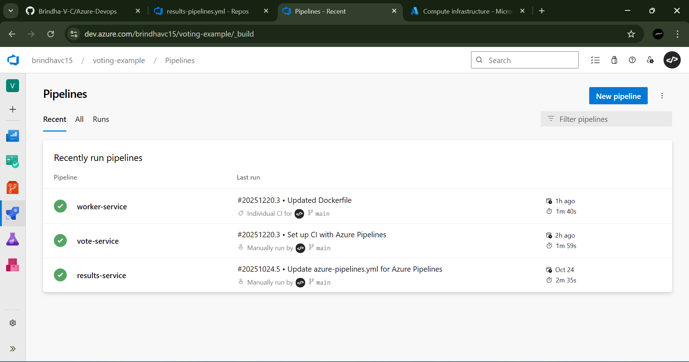
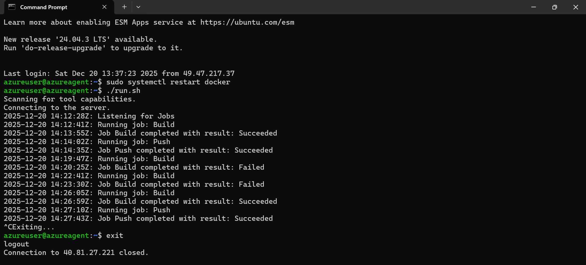
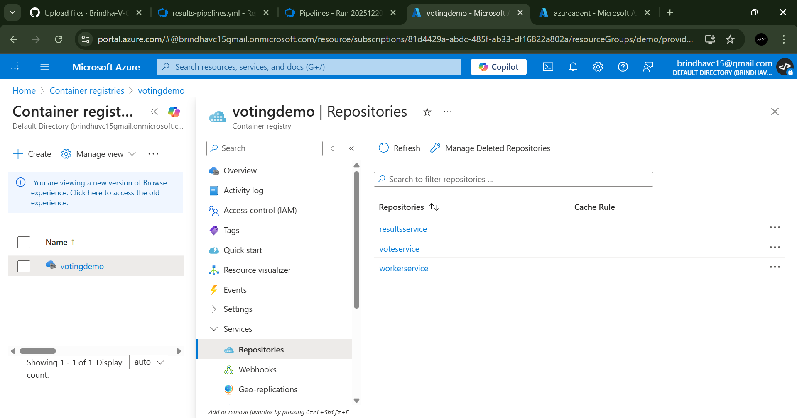

# Azure DevOps — CI/CD for example-voting-app

This repository implements a CI/CD workflow for the multi micro-service "example-voting-app" (from DockerSamples) using Azure DevOps for CI, ArgoCD for continuous delivery, and Kubernetes for runtime deployment.

The goal is to demonstrate a full pipeline: build container images for each microservice, push them to a container registry from Azure DevOps pipelines, and deploy/manage the application in a Kubernetes cluster using ArgoCD.

This repo contains Azure DevOps pipeline YAMLs and helper scripts to automate manifest updates.

## Repository layout

- `pipelines/`
	- `results_pipeline.yml` — CI pipeline for the results service 
	- `vote_pipeline.yml` — CI pipeline for the vote service 
	- `worker_pipeline.yml` — CI pipeline for the worker service 

- `scripts/`
	- `updatek8smanifest.sh` — helper script to update image tags in Kubernetes manifests (used by CI/CD to pin images)

> Note: The application source and original manifests are based on the upstream example at: https://github.com/dockersamples/example-voting-app/tree/main

## High-level architecture

- Multiple microservices (vote, result, worker, redis, db, nginx) run as separate containers.
- CI (Azure DevOps): builds Docker images for each service, and pushes images to a container registry (Azure Container Registry, Docker Hub, or other).
- CD (ArgoCD): watches a Git repository containing Kubernetes manifests (this repo or a separate repo) and synchronizes the cluster state to the desired manifests. Image tags are updated by CI (using `updatek8smanifest.sh`) and committed to the manifests branch that ArgoCD watches.

## CI pipelines (Azure DevOps)

Each YAML under `pipelines/` corresponds to a service-specific CI pipeline. Typical responsibilities:

- Checkout source code
- Build the Docker image for the service
- Run unit/integration tests (if configured)
- Tag the image (e.g., `$(Build.BuildId)` or semantic tag)
- Push the image to a container registry
- Optionally update Kubernetes manifests with the new image tag and push those changes to the manifests branch for ArgoCD to pick up

Configure Azure DevOps pipeline variables / service connections for:

- Container registry credentials (ACR or Docker Hub)
- Kubernetes / Git credentials (if pipelines push manifest updates to the manifests repo)

## Continuous Delivery with ArgoCD

ArgoCD continuously monitors a Git repo and a path (or a Helm chart) and reconciles a Kubernetes cluster to match the declared manifests. Typical flow with this repo:

1. CI builds and pushes a new image tag.
2. CI updates the Kubernetes manifest (image tag) using `scripts/updatek8smanifest.sh` and commits the change to the manifests branch.
3. ArgoCD detects the Git change and syncs the new manifests to the cluster, causing a rolling update of the deployment.

You can also use image automation tools (like ArgoCD Image Updater or Flux image automation) to avoid manual manifest commits.

## Kubernetes

This project expects Kubernetes manifests compatible with the example-voting-app (Deployments, Services, ConfigMaps). The `scripts/updatek8smanifest.sh` is provided to help substitute new image tags into manifests before committing.

Common kubernetes commands used during debug or local testing:

```bash
# apply manifests
kubectl apply -f ./k8s-manifests/

# view deployments
kubectl get deployments -n <namespace>

# view pods
kubectl get pods -n <namespace>

# logs
kubectl logs -l app=vote -n <namespace>
```

## Results




